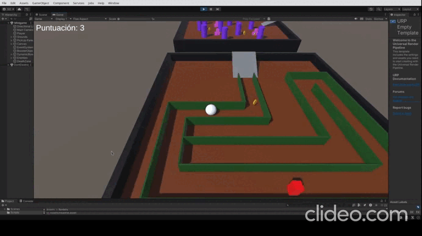
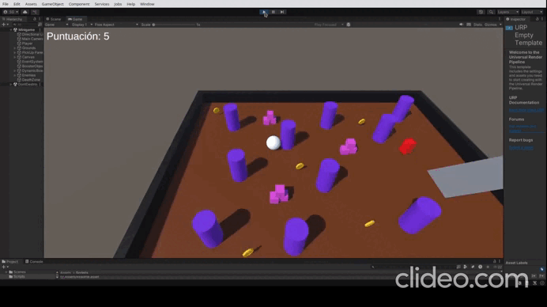
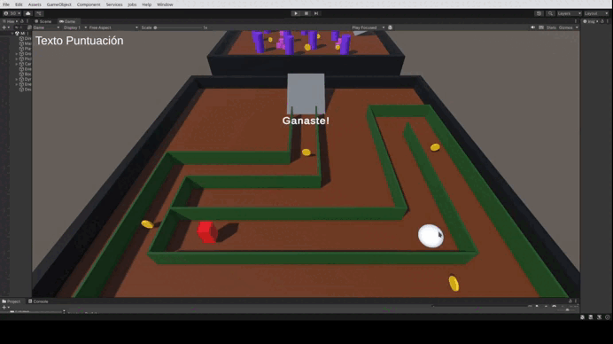
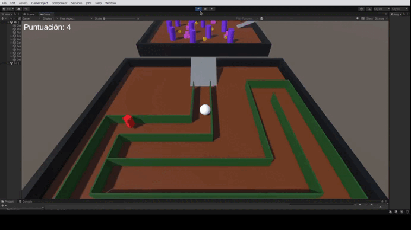
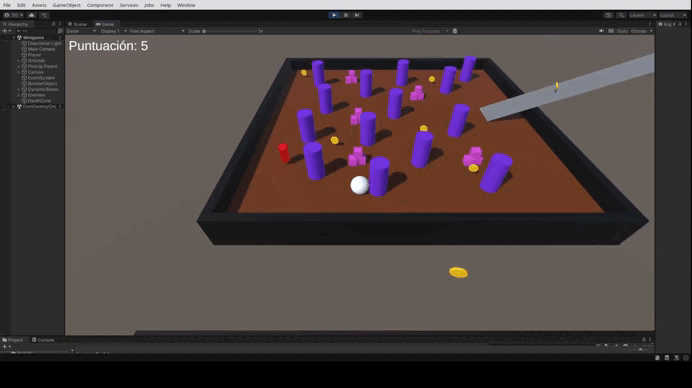
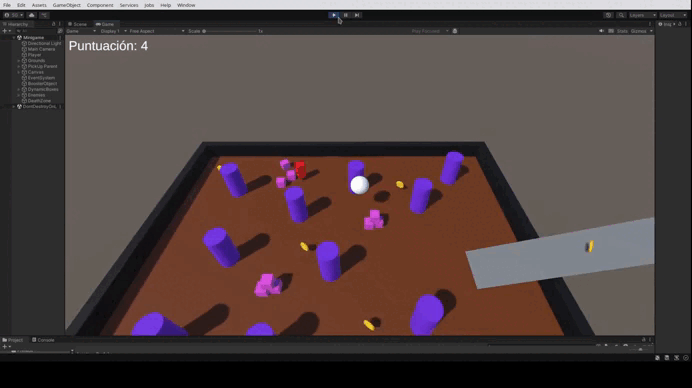
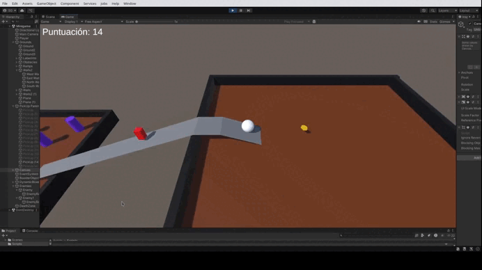
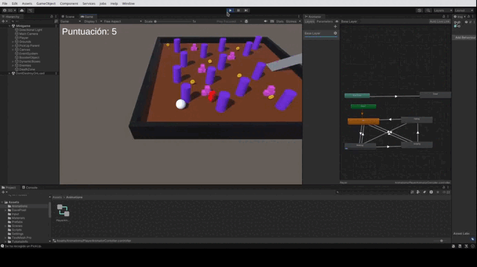

# Proyecto PMDM RollABall

## Descripción

Este proyecto es una implementación de un juego de tipo *Roll-a-ball* en Unity, donde se controla a un jugador (representado por una esfera) que puede moverse en un entorno 3D y recoger objetos mientras escapa de dos enemigos. El juego también incluye dos tipos de cámaras: una en tercera persona y otra en primera persona, que el jugador puede alternar. El objetivo es familiarizarse con el uso de *Rigidbody*, control de entrada del teclado, y manejo de cámaras en Unity.

puede moverse en un entorno 3D y recoger objetos mientras escapa de dos enemigos. El juego también incluye dos tipos de cámaras: una en tercera persona y otra en primera persona, que el jugador puede alternar. El objetivo es familiarizarse con el uso de *Rigidbody*, control de entrada del teclado, y manejo de cámaras en Unity.

<details>

   <summary><b>FUNCIONALIDADES IMPLEMENTADAS</b></summary>

### **Movimiento del Jugador**
El jugador puede moverse en el entorno 3D utilizando las teclas de flecha. El movimiento se controla aplicando fuerzas físicas, lo que permite un control suave y realista.

### **Control de Cámaras**
El jugador puede cambiar entre la vista en primera persona y la vista en tercera persona presionando los botones 1 y 2, respectivamente. Esto permite al jugador elegir la perspectiva que prefiera para jugar.



### **Contacto con Obstáculos**
El jugador puede interactuar con varios obstáculos en el entorno. Estos obstáculos pueden ser derribados o empujados, añadiendo un elemento de física al juego.



### **Recolección de Pickups**
El jugador puede recoger objetos etiquetados como "PickUp". Al recoger estos objetos, se incrementa un contador y el objeto se desactiva. El objetivo es recoger todos los pickups para ganar el juego.

### **Persecución del Enemigo**
Dos enemigos persiguen al jugador, creando un desafío adicional. Los enemigos se mueven hacia el jugador, aumentando la dificultad del juego.




### **Boost de la Rampa**
El jugador puede recibir un impulso al pasar por una rampa especial. Este impulso permite saltos más altos o movimientos más rápidos.




### **Salto del Jugador**
El jugador puede saltar al presionar la tecla de espacio. El salto se realiza aplicando una fuerza hacia arriba, y solo es posible si el jugador está en el suelo.




### **Condición de Derrota**
Si un enemigo toca al jugador, se muestra un mensaje de "¡Perdiste!" en la pantalla, indicando que el jugador ha sido atrapado.




### **Condición de Victoria**
Cuando el jugador recoge todos los pickups, se muestra un mensaje de "¡Ganaste!" en la pantalla. Además, los enemigos son eliminados automáticamente al alcanzar la puntuación máxima.



</details>

<details>
      <summary><b>SCRIPTS UTILIZADOS</b></summary>
   

### `PlayerController.cs`

El script `PlayerController.cs` maneja el control del jugador, permitiendo su movimiento en función de las teclas de flecha y la interacción con objetos dentro del juego. A continuación, se explica cómo se implementa el movimiento del jugador:

1. **Movimiento del Jugador**:  
   El jugador se mueve en el espacio 3D utilizando un `Rigidbody` para aplicar fuerzas de movimiento. Las teclas de flecha controlan el movimiento del jugador en el plano horizontal (X y Y).
   
   - Se detecta si se presionan las teclas de flecha (`Keyboard.current.upArrowKey`, `Keyboard.current.downArrowKey`, `Keyboard.current.leftArrowKey`, `Keyboard.current.rightArrowKey`).
   - Cuando se detecta un movimiento, se actualizan las variables `movementX` y `movementY` con los valores correspondientes.
   - En el método `FixedUpdate()`, se calcula el movimiento relativo a la cámara para que el jugador se mueva en la misma dirección en que la cámara está mirando.

2. **Interacción con Objetos**:  
   El jugador puede recoger objetos etiquetados con "PickUp". Cada vez que el jugador entra en contacto con un objeto de este tipo, el contador aumenta y el objeto se desactiva.

3. **Salto del Jugador**:  
   El jugador puede saltar al presionar la tecla de espacio (`Keyboard.current.spaceKey`). Se aplica una fuerza hacia arriba al `Rigidbody` del jugador para realizar el salto. Solo puede saltar si la bola está en el suelo gracias a los métodos `collision.gameObject` que detecta si el jugador está tocando el suelo.
   
4. **Condición de Victoria**:
   - Cuando el jugador recoge todas las monedas, se muestra un texto de "¡Ganaste!" en la pantalla. Al ganar la partida se destruye automáticamente a los enemigos con `Destroy` cuando la cuenta de puntuación llegue a la máxima.

5. **Condición de Derrota**:
   - Cuando un enemigo toca al jugador, se muestra un texto de "¡Perdiste!" en la pantalla.

### `CameraController.cs`

El script `CameraController.cs` gestiona las dos cámaras (tercera y primera persona) y permite alternar entre ellas.

1. **Vista en Tercera Persona**:
   - La cámara sigue al jugador desde una posición detrás y por encima de él, con un offset calculado dinámicamente en el inicio (`thirdPersonOffset`).
   - El jugador siempre está en el centro de la vista, y la cámara está fija mirando al jugador.
   - Se ajusta la altura (`thirdPersonHeight`) y la distancia.

### `EnemyController.cs`

El script `EnemyController.cs` maneja el comportamiento de los enemigos que persiguen al jugador.

1. **Movimiento de los Enemigos**:
   - Los enemigos se mueven hacia el jugador utilizando un `NavMeshAgent` para navegar por el entorno.
   - La velocidad y la aceleración del enemigo se configuran en el inspector de Unity.

### `RampBoosterTrigger.cs`

El script `RampBoosterTrigger.cs` gestiona el objeto transparente en la rampa que da un impulso al jugador al pasar por ella.

1. **Impulso en la Rampa**:
   - En el método `OnTriggerEnter(Collider other)`, se detecta cuando el jugador entra en contacto con el objeto de impulso.
   - Si el objeto que entra en contacto tiene la etiqueta "Player", se obtiene el `Rigidbody` del jugador.
   - Se aplica una fuerza hacia arriba al `Rigidbody` del jugador utilizando `AddForce()` con `ForceMode.Impulse`.
   - La fuerza aplicada se define por la variable `boostForce`, que puede ser ajustada en el inspector de Unity.

### `Rotator.cs`

El script `Rotator.cs` se encarga de rotar continuamente un objeto en el juego.

1. **Rotación Continua**:
   - En el método `Update()`, se aplica una rotación constante al objeto utilizando `transform.Rotate()`.
   - La rotación se realiza en el eje Z con velocidad de 50 grados por segundo para que gire solo sobre ese eje.
   - `Time.deltaTime` se utiliza para asegurar que la rotación sea independiente de la velocidad de fotogramas.

</details>

<details>

   <summary><b>USO DE ESTADOS</b></summary>

### **Uso de Estados**

**¿Por qué usar estados?**

En un videojuego, un personaje puede realizar varias acciones: caminar, saltar, caer, atacar, etc. Para gestionar estas acciones de manera eficiente y evitar conflictos entre ellas, se utilizan **estados**.

Ventajas de usar un sistema de estados
✔ Código más organizado: Separa la lógica de cada acción del personaje.
✔ Evita errores: Controla las transiciones entre estados sin conflictos.
✔ Facilita la depuración: Es más fácil identificar problemas cuando cada acción tiene su propio estado.
✔ Escalabilidad: Permite agregar nuevos estados sin afectar los existentes.

**Uso de Estados en este Proyecto**
  
En este juego, el personaje tiene los siguientes estados:

1️⃣ Idle (Quieto)
👉 Cuando el jugador no se está moviendo ni saltando.

2️⃣ Walking (Caminando)
👉 Cuando el jugador se mueve con las teclas de dirección.
👉 Solo se activa si el jugador está en el suelo.

3️⃣ Jumping (Saltando)
👉 Se activa al presionar la barra espaciadora cuando el jugador está en el suelo.
👉 Mientras está en el aire por un salto, permanece en este estado.

4️⃣ Falling (Cayendo)
👉 Se activa cuando el jugador está en el aire pero ya no está subiendo (ejemplo: después de alcanzar la altura máxima del salto o al caminar fuera de una plataforma).
👉 Finaliza cuando el personaje toca el suelo.

**Como se gestionan los estados en el código**
El estado del jugador se maneja con una enumeración (enum) y una variable que almacena el estado actual:
```bash
private enum PlayerState { Idle, Walking, Jumping, Falling, Dead }
private PlayerState currentState;
```

**Transiciones entre Estados**
Los estados cambian bajo ciertas condiciones:

- Idle → Walking → Cuando el jugador presiona una tecla de movimiento.
- Idle/Walking → Jumping → Cuando el jugador presiona la tecla de salto y está en el suelo.
- Jumping → Falling → Cuando el personaje alcanza la cima del salto y empieza a descender.
- Falling → Idle / Walking → Cuando el personaje toca el suelo, vuelve a Idle si no se mueve, o a Walking si sigue moviéndose.

Este cambio se actualiza en el método UpdateAnimator() que sincroniza el estado con las animaciones:

```bash
void UpdateAnimator()
{
    animator.SetBool("isWalking", currentState == PlayerState.Walking);
    animator.SetBool("isJumping", currentState == PlayerState.Jumping);
    animator.SetBool("isFalling", currentState == PlayerState.Falling);
}
```

**Animator Controller en Unity**

El Animator Controller es una herramienta en Unity que permite gestionar las animaciones de un personaje mediante un sistema de estados y transiciones. De esta manera se puede observar de manera muy visual los cambios de estados en el juego a medida que avanza.



</details>

<details>

   <summary><b>USO DE EULER</b></summary>

### **Uso de Euler en la Rotación**

En el modo de cámara en primera persona, utilizamos la rotación de la cámara basada en los ángulos de Euler (específicamente `Quaternion.Euler(rotationX, rotationY, 0f)`) para controlar la orientación de la cámara:

- **¿Por qué usar Euler?**
  La rotación en 3D puede ser complicada debido al fenómeno conocido como *gimbal lock* (bloqueo de cardán), que ocurre cuando las rotaciones en los tres ejes (X, Y, Z) se alinean de tal forma que se pierde un grado de libertad. Sin embargo, en este caso, para una rotación simple y controlada en los ejes X (vertical) y Y (horizontal), utilizar ángulos de Euler es adecuado para los movimientos básicos de la cámara. Usamos `Quaternion.Euler()` para convertir los valores de los ángulos en una representación adecuada para Unity sin tener que preocuparnos por las complejidades de las matrices de rotación o los cuaterniones manualmente.

  El uso de Euler permite aplicar rotaciones sencillas basadas en la entrada del usuario, sin necesidad de cálculos adicionales, y resulta eficaz para un control directo de la cámara en un entorno de juego como el de este proyecto.

</details>

<details>

## Conclusión

   <summary><b>CONCLUSIÓN</b></summary>

Con este proyecto, se implementaron dos sistemas de cámaras en Unity que permiten alternar entre vista en primera persona y tercera persona, así como un sistema de control para el jugador utilizando un `Rigidbody` y la entrada del teclado. Esta tarea ayuda a comprender cómo trabajar con la cámara y los controles del jugador en Unity, así como a manejar interacciones básicas con objetos dentro del juego.

La implementación de la rotación de la cámara en primera persona utilizando Euler ha permitido un control preciso y sencillo de la orientación del jugador sin necesidad de complejidades adicionales.

</details>
